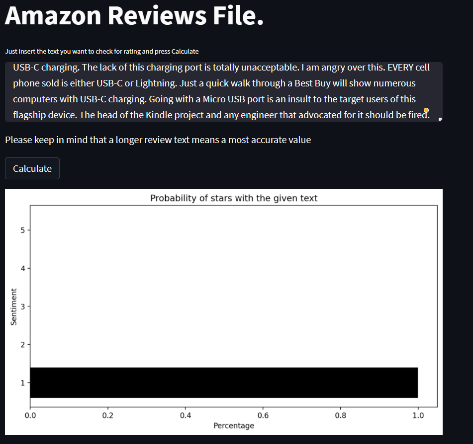
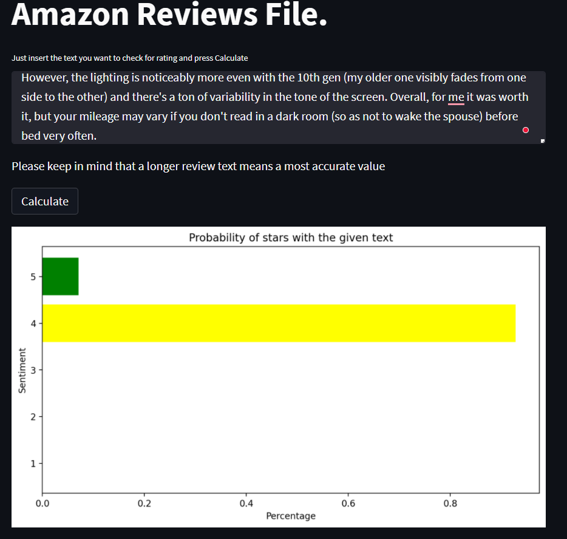
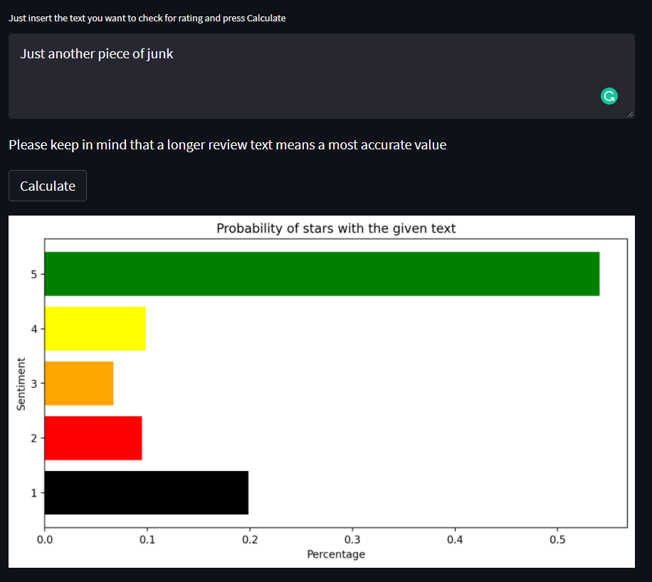

# Amazon Rating Analysis

## Preparation of the data.

This text is included in torchtext an has 3.000.000 comments to amazon products.We can see that the data has the following structure.

- Stars 
- Title
- MainBody

So the first thing to do is to slice the data in tranches to be able to process the information (I do not have a data center with nice computer power at home)

So with this data it is necessaryto slice it.

 ### **a_prepare_data.py**

This file justgenerates the .csv in order to load them afterwards.
	
### **b_data_prep.py**

Here is to find the preparation of the data after has been sliced accordingly.
	
The tokenicer is defined, in this case spacey.
	
`nlp = spacy.load("en_core_web_sm")`

The vectorizer I am using is Fasttext the simp,le verison, with 300 dimensions.	After defininf it, I am changing the vector associated with padded values en the asociated with none to -1 and 0 respectively.

`ft_vec = FastText("simple")`

`ft_vec.vectors[1] = -torch.ones(ft_vec.vectors[1].shape[0])` 

`ft_vec.vectors[0] = torch.zeros(ft_vec.vectors[0].shape[0])`
	

With this two objects defined it is possible to perform the activities of removing the stop words, encoding the tokens 

I will use the fasttext vectorizen model with a length of 300. This mean we will vertorize every token with a 300 dimension vector.

I order to keep the size of the data reasonable, I decided to introduce the vectorization part at the very last moment integrating it into the collate function of the dataloader class.

### **c_model.py**

Here is the model definition used a simple two full connected layers.

### **d_model_training***

## Use and install it

If you want just to use the final model, you just have to run the streamlit version of the model with:

`streamlit run st_predict.py`

and in [localhost:8501](https://localhost:8501 "Localhost") yopu can se the results.

## Results

It is really not performing very well, having a accuracy around 28%. The accuracy dictated by statistic would be 20%, so the improvement is not much. 

I tried then to reduce the number of classes from 5 (stars) to 2 (positive and negative) and the results are around. You will have to to have a look in data_prep wherethe stars are reduced (line 41), and in the model definition after the las full layer ( just reduce the variable num_classes from 5 to 2)

The 5 categories version is having an accuracy of 38% tha is 18% more as the statistical 20% from random.

The 2 categories version is having an accuracy of 67% tha is 17% more as the statistical 50% from random.

I think is can be of more interest to keep the 5 stars version and i left is like is. It is possible to train the model for 2 classes in no time if needed, or evn better to ponderate the 5 classes resultto see the tendence.

Here are a couple of examples of the model.

### 1 Bad Review (Real review from amazon site)

### 2 Medium Review (Real review from amazon site)

### 3 Good Review (Real review from amazon site)

### 4 Very short review

WIth very short reviews, even usin a word like "junk" the results are not tat accurate. 
